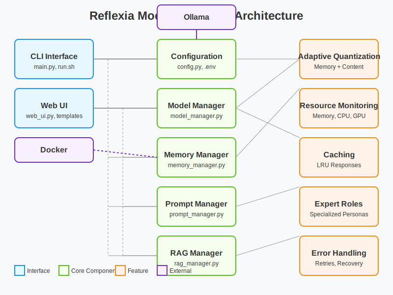

# Reflexia Model Manager API Reference

This document provides detailed API reference for the Reflexia Model Manager components.

## Architecture Overview

The diagram above shows the main components of the Reflexia Model Manager and how they interact.

## Table of Contents

- [Config](#config)
- [ModelManager](#modelmanager)
- [MemoryManager](#memorymanager)
- [PromptManager](#promptmanager)
- [RAGManager](#ragmanager)
- [WebUI](#webui)

---

## Config

The `Config` class handles configuration management for reflexia Model Manager.

### Methods

#### `__init__(config_path=None)`

Initialize configuration, optionally from a specific file path.

**Parameters:**
- `config_path` (str, optional): Path to the configuration file.

#### `get(section, key=None, default=None)`

Get configuration value(s).

**Parameters:**
- `section` (str): Configuration section name.
- `key` (str, optional): Configuration key within the section. If None, returns entire section.
- `default` (any, optional): Default value to return if the key is not found.

**Returns:**
- The configuration value, or the default if not found.

#### `set(section, key, value)`

Set a configuration value.

**Parameters:**
- `section` (str): Configuration section name.
- `key` (str): Configuration key within the section.
- `value` (any): Value to set.

**Returns:**
- `bool`: True on success.

#### `load_config()`

Load configuration from file.

**Returns:**
- `bool`: True on success, False on failure.

#### `save_config()`

Save configuration to file.

**Returns:**
- `bool`: True on success, False on failure.

---

## ModelManager

The `ModelManager` class handles model loading, inference, and interaction with Ollama.

### Methods

#### `__init__(config)`

Initialize the model manager.

**Parameters:**
- `config` (Config): Configuration object.

#### `load_model()`

Load the model into memory.

**Returns:**
- `bool`: True on success, False on failure.

#### `generate_response(prompt, system_prompt=None, temperature=0.7, top_p=0.9)`

Generate a response from the model.

**Parameters:**
- `prompt` (str): User prompt text.
- `system_prompt` (str, optional): System instructions for model behavior.
- `temperature` (float, optional): Sampling temperature, controls randomness.
- `top_p` (float, optional): Nucleus sampling parameter, controls diversity.

**Returns:**
- `str`: Generated response text.

#### `cached_response(prompt, system_prompt=None, temperature=0.7, top_p=0.9)`

Cached version of generate_response.

**Parameters:**
- Same as `generate_response`.

**Returns:**
- `str`: Generated response text, potentially from cache.

#### `set_cache_size(size)`

Update the LRU cache size.

**Parameters:**
- `size` (int): New cache size.

#### `clear_cache()`

Clear the response cache.

#### `set_quantization(quantization_type)`

Change the model quantization method.

**Parameters:**
- `quantization_type` (str): Type of quantization to use (q4_0, q4_k_m, q5_k_m, q8_0, f16).

**Returns:**
- `bool`: Success status.

#### `adaptive_quantization(memory_manager=None, content_complexity=None)`

Adaptively change quantization based on memory pressure and content complexity.

**Parameters:**
- `memory_manager` (MemoryManager, optional): MemoryManager instance to monitor memory.
- `content_complexity` (float, optional): Estimated complexity of the content (0-1).

**Returns:**
- `bool`: True if quantization was changed.

#### `estimate_content_complexity(text)`

Estimate content complexity to guide quantization level.

**Parameters:**
- `text` (str): Text content to analyze.

**Returns:**
- `float`: Complexity score (0-1), higher means more complex.

---

## MemoryManager

The `MemoryManager` class handles memory usage, caching, and resource monitoring.

### Methods

#### `__init__(config, model_manager=None)`

Initialize the memory manager.

**Parameters:**
- `config` (Config): Configuration object.
- `model_manager` (ModelManager, optional): ModelManager instance.

#### `get_memory_stats()`

Get current memory usage statistics.

**Returns:**
- `dict`: Memory usage statistics.

#### `cache_response(prompt, response)`

Cache a response.

**Parameters:**
- `prompt` (str): Prompt string.
- `response` (str): Response string.

#### `get_cached_response(prompt)`

Get a cached response if available.

**Parameters:**
- `prompt` (str): Prompt string.

**Returns:**
- `str` or `None`: Cached response or None if not found.

#### `reduce_memory_pressure()`

Attempt to reduce memory pressure.

**Returns:**
- `bool`: Success status.

#### `adaptive_chunk_size(text_length, base_chunk_size=1000)`

Adaptively determine chunk size based on text length and available memory.

**Parameters:**
- `text_length` (int): Length of text to chunk.
- `base_chunk_size` (int, optional): Default chunk size.

**Returns:**
- `int`: Recommended chunk size.

#### `should_use_quantization()`

Determine if model should use more aggressive quantization.

**Returns:**
- `bool`: True if more aggressive quantization is recommended.

#### `get_detailed_memory_stats()`

Get detailed memory statistics including trends.

**Returns:**
- `dict`: Detailed memory statistics.

---

## PromptManager

The `PromptManager` class handles prompts, templates, and expert personas.

### Methods

#### `__init__(config)`

Initialize the prompt manager.

**Parameters:**
- `config` (Config): Configuration object.

#### `get_system_prompt(role=None)`

Get the system prompt, optionally for a specific expert role.

**Parameters:**
- `role` (str, optional): Role identifier.

**Returns:**
- `str`: System prompt.

#### `set_system_prompt(prompt)`

Set a new system prompt.

**Parameters:**
- `prompt` (str): New system prompt.

**Returns:**
- `bool`: Success status.

#### `format_prompt(user_input, template_name="default", role=None)`

Format a prompt using a template and optionally an expert role.

**Parameters:**
- `user_input` (str): User input text.
- `template_name` (str, optional): Template to use.
- `role` (str, optional): Expert role to use.

**Returns:**
- `str`: Formatted prompt.

#### `add_template(name, template)`

Add a new template.

**Parameters:**
- `name` (str): Template name.
- `template` (str): Template string.

**Returns:**
- `bool`: Success status.

#### `remove_template(name)`

Remove a template.

**Parameters:**
- `name` (str): Template name.

**Returns:**
- `bool`: Success status.

#### `add_expert_role(role_id, name, system_prompt, domain="Other", capabilities=None, icon=None)`

Add a new expert role.

**Parameters:**
- `role_id` (str): Unique role identifier.
- `name` (str): Display name for the role.
- `system_prompt` (str): System prompt for the role.
- `domain` (str, optional): Role domain category.
- `capabilities` (list, optional): List of capabilities.
- `icon` (str, optional): Emoji icon for the role.

**Returns:**
- `bool`: Success status.

#### `remove_expert_role(role_id)`

Remove an expert role.

**Parameters:**
- `role_id` (str): Role identifier.

**Returns:**
- `bool`: Success status.

#### `get_templates()`

Get all available templates.

**Returns:**
- `dict`: Dictionary of templates.

#### `get_expert_roles(domain=None)`

Get all expert roles, optionally filtered by domain.

**Parameters:**
- `domain` (str, optional): Domain to filter by.

**Returns:**
- `dict`: Dictionary of expert roles.

#### `get_expert_domains()`

Get all available expert domains.

**Returns:**
- `list`: List of domain names.

#### `get_recent_roles(count=None)`

Get recently used roles.

**Parameters:**
- `count` (int, optional): Number of roles to return.

**Returns:**
- `list`: List of recent roles.

#### `search_roles(query)`

Search for expert roles matching a query.

**Parameters:**
- `query` (str): Search query.

**Returns:**
- `list`: List of matching roles.

---

## RAGManager

The `RAGManager` class handles Retrieval-Augmented Generation.

### Methods

#### `__init__(config, model_manager=None)`

Initialize the RAG manager.

**Parameters:**
- `config` (Config): Configuration object.
- `model_manager` (ModelManager, optional): ModelManager instance.

#### `is_available()`

Check if RAG is available.

**Returns:**
- `bool`: True if RAG is available.

#### `add_documents(documents)`

Add documents to the vector database.

**Parameters:**
- `documents` (list): List of documents with id, text, and metadata.

**Returns:**
- `bool`: Success status.

#### `chunk_text(text)`

Chunk text into smaller pieces.

**Parameters:**
- `text` (str): Text to chunk.

**Returns:**
- `list`: List of text chunks.

#### `load_file(file_path, metadata=None)`

Load a file into the vector database.

**Parameters:**
- `file_path` (str or Path): Path to the file.
- `metadata` (dict, optional): Additional metadata.

**Returns:**
- `bool`: Success status.

#### `query(query_text, collection_name="documents", n_results=None, filter_criteria=None)`

Query the vector database.

**Parameters:**
- `query_text` (str): Text to search for.
- `collection_name` (str, optional): Collection to search in.
- `n_results` (int, optional): Number of results to return.
- `filter_criteria` (dict, optional): Filter criteria.

**Returns:**
- `list`: Query results.

#### `generate_rag_response(query_text, system_prompt=None, collection_name="documents")`

Generate a response using RAG.

**Parameters:**
- `query_text` (str): User query.
- `system_prompt` (str, optional): System prompt to use.
- `collection_name` (str, optional): Collection to query.

**Returns:**
- `dict`: Response with context information.

---

## WebUI

The `WebUI` class provides a web-based user interface.

### Methods

#### `__init__(config, model_manager, memory_manager, prompt_manager, rag_manager=None)`

Initialize the Web UI.

**Parameters:**
- `config` (Config): Configuration object.
- `model_manager` (ModelManager): ModelManager instance.
- `memory_manager` (MemoryManager): MemoryManager instance.
- `prompt_manager` (PromptManager): PromptManager instance.
- `rag_manager` (RAGManager, optional): RAGManager instance.

#### `start(debug=False, threaded=False)`

Start the web UI server.

**Parameters:**
- `debug` (bool, optional): Enable debug mode.
- `threaded` (bool, optional): Run in a separate thread.

**Returns:**
- `bool`: Success status.